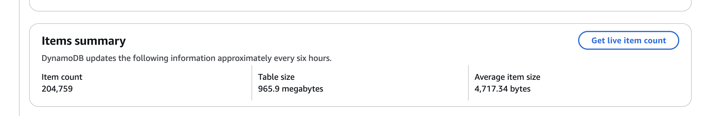
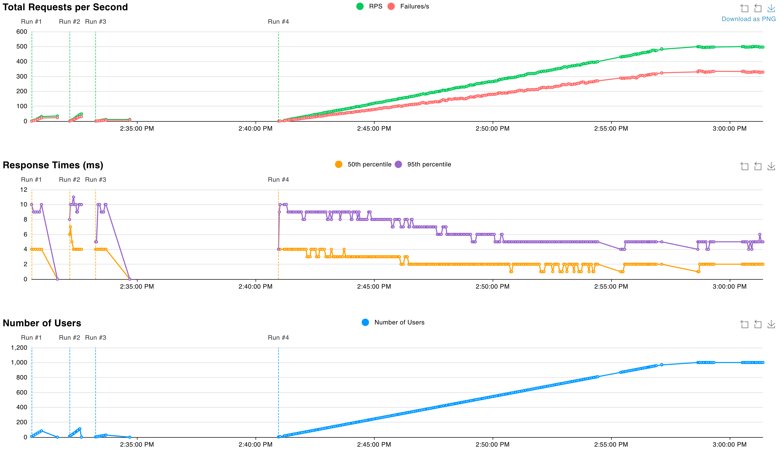

# Mystery Book Query System with AWS and Google Gemini API Integration 

## Authors: Peter de Guzman, Ilseop Lee, Eric Ortega Rodriguez, and Zachary Fennie

## Status Badges

## Our project developed a microservice (using a Flask app) that interfaces with mystery book data from Goodreads and Amazon Web Services.

For the data engineering aspect, we utilized libraries such as Pandas, and a NoSQL AWS DynamoDB database. We implemented Infrastructure as Code (IaC) using tools like AWS CloudFormation and created an automated CI/CD pipeline with GitHub Actions to manage the infrastructure, integration, and deployment of the microservice. Our repository contains a comprehensive README.md, an architectural diagram, and proper GitHub/GitLab configurations to ensure the project is fully reproducible. Additionally, we performed a quantitative assessment of the system's reliability and stability, analyzing performance metrics like latency at different request rates. This project utilized Docker, AWS DynamoDB, AWS Elastic Container Registry (ECR) and AWS AppRunner to facilite the ETL pipeline, data storage and deployment of the microservice, and containerization for portability and reproducibility.

The project is accompanied by a demo video (below) that showcases the ETL pipeline, application, AWS integration, a load test, and system performance. Each team member also submitted a reflection report (included as a PDF), including peer evaluations and a reflection on our group feedback session. 

#### Demo Video (Click the image to view the YouTube video)

### Project Diagram 

### Data - Goodreads.com Mystery, Thriller & Crime Genre Dataset
Our dataset, created by Mengting Wan, was collected in late 2017 from Goodreads.com. It specifically focuses on users' public shelves, which are accessible to everyone on the web without requiring a login. The dataset includes anonymized User IDs and Review IDs to protect privacy. Specifically, the data we used was the Mystery, Thriller & Crime genre, containing data on 219,235 books, 24,799,896 interactions, and 1,849,236 detailed reviews. This rich dataset is used to analyze user behavior, book preferences, and interactions within the genre, providing valuable insights for recommendations and data-driven decision-making in our microservice. The data can be accessed via Menting Wan's repository at https://github.com/MengtingWan/goodreads.

### ETL Pipeline

Two Python scripts are used to orchestrate the Extract-Transform-Load pipeline. `extract.py` is used to parse the JSON files downloaded from the GitHub repository into CSV files. Once the mystery books and authors datasets are both in CSV format, a left join is performed to integrate author names, ratings, and other information into the mystery books dataset and relevant variables are selected for analysis. 

The `load.py` script contains multiple functions to facilitate data loading and table management in AWS DynamoDB. The `create_table()` function creates a DynamoDB table with "book_id" as the partition key. The next function `load_csv_to_dynamodb()` loads the merged book-author data from a CSV into the DynamoDB table. This is done through batch processing to account for the large volume of books in the dataset. 

### DynamoDB Table Items Summary

### Core Files of the Repo:
* `Dockerfile`
* `mylib`
    - `extract.py`
    - `gemini.py`
    - `load.py`
    - `query.py`
    - `test_app.py`
* `static`
    - `style.css`
* `template`
    - `homepage.html`
    - `project.html`
    - `result.html`
* `app.py`
* `LICENSE`
* `load_test.py`
* CI/CD pipeline
* `Makefile`
* `requirements.txt`
* `README.md`

### Infrastructure as Code (IaC)

To implement Infrastructure as Code, this project has a `IaC.yml` file which is configured to run through GitHub Actions. By following the commands in order, you can see that this automated redeployment works through multiple steps. The process begins by checking out the code and authenticating with AWS Elastic Container Registry (ECR) and Docker. Then, it continues by building and tagging the Docker image, pushing the Docker image to AWS ECR, and updating the AWS AppRunner service to deploy the Flask application. 

### Load Test 

We conducted a load test using the `Locust` package to evaluate the performance of our Flask application under increasing user loads.

  

The system achieved a peak of ~550 RPS, with ~500 successful requests per second (90.91% success rate). Failures began at ~300 RPS, stabilizing at ~50–70 failures/s during peak load. Response times were stable, with a median of ~3–4 ms and a 95th percentile of ~8–10 ms, though variability indicates potential bottlenecks. The application scaled to ~1,200 users at ~60 users/min before performance degradation.

For the full analysis, see the [Locust.pdf](Locust.pdf).

### Quantitative Assessment

### Use of GenAI:
Our team used Generative AI to explore tools and packages that were new to us in conjunction with seeking out the software documentation and other learning resources. This included using the `locust` package in Python for load testing and the Google Gemini API to integrate prompts into our Flask app. 

